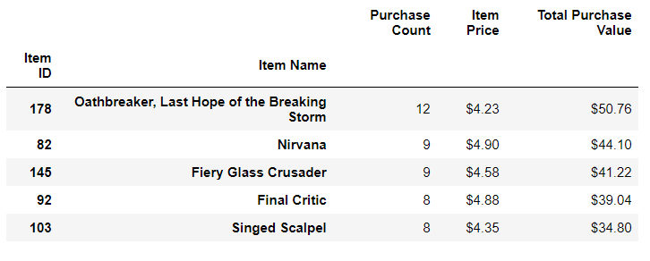

# Pandas-Challenge

## Heroes of Pymoli 

In this exercise we are analyzing the data from a csvfile that contains information about players and game purchases.

## Observable Trends

Age Range

* 44.79% of players are in the age range of 20-24 years old. As you look at players that are younger and older than this age range you see a gradual decline in the number of players, moving away from the central tendency.

Most Purchased and Profitable Items

* Item ID 178 "Oathbreaker, Last Hope of the Breaking Storm", Item ID 82 "Nirvana" and Item ID 145 "Fiery Glass Crusader" were the top 3 most purchased items. In addition, they were within the top 5 items with the highest purchase value. Given this data, we can assume these are the most popular and 
most profitable items. Therefore, to create more revenue, we can focus on creating incentives for players within the gameplay to purchase these items, specifically those players who have not purchased these items in the past. Furthermore, since the data shows a trend of re-purchase for these items, players
will be likely to re-purchase these items again.

* The 5th most purchased item, "Pursuit Cudgel of Necromancy," has a total purchase value of $8.16. This value is considerably lower than the 4th most purchased item. 
Based on this trend we may want to de-incentivize players from purchasing this specific item since it is not creating considerable revenue. Alternatively, we can raise the price of this item to generate more revenue, since it is popular. 

Top 5 Most Profitable Items

Top 5 Most Purchased Items

